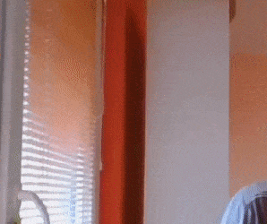

# Froobit AR project

Augmented reality QR code image replacement written in JavaScript.

**Rendering** 
FroobitJS WebGL dynamic layers with 3d matrix transform

With FroobitJS - [https://www.npmjs.com/package/froobit](https://www.npmjs.com/package/froobit)

P5js - [https://github.com/processing/p5.js](https://github.com/processing/p5.js)

Vector and matrix and geometry with Sylvester - [http://sylvester.jcoglan.com/](http://sylvester.jcoglan.com/)

**QR detection** 
Detecting QR code position & alignment markers and corner keypoints

With JsQR library - [https://github.com/cozmo/jsQR](https://github.com/cozmo/jsQR) (JavaScript library for QR code detection and decoding)

**Keypoint tracking** 
Tracking QR code markers with Optical Flow (Iterative Lucas-Kanade method with pyramids)

Using JsFeat library - [https://github.com/inspirit/jsfeat](https://github.com/inspirit/jsfeat)

## Live demo

[Check it out here](https://ognjenvucko.github.io/froobit-ar/)

## License

 
This work is available under [MIT license](./LICENSE)
